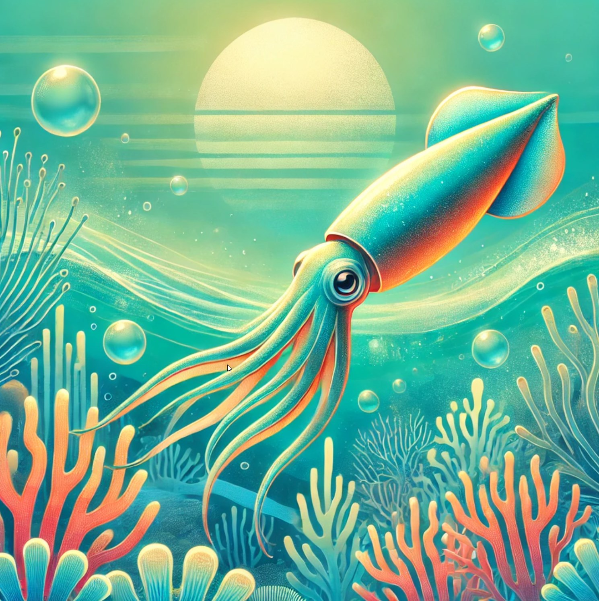

# Interactive Gallery with Scroll Animations

## Overview
This project demonstrates a more advanced use of **GSAP** and **ScrollTrigger** to create an interactive image gallery. The images animate with a parallax-like effect when the user scrolls through the page, and each image also has a hover effect.

## Features
- **Scroll-triggered animations**: Each image in the gallery animates as the user scrolls down the page.
- **Parallax effect**: Images scale up and change opacity smoothly during scrolling.
- **Hover effects**: Images scale up slightly and become less transparent when hovered over.

## How to Add Images to the Gallery
1. Place your images in the **`images`** folder with names like `1.jpg`, `2.jpg`, etc.
2. Update the HTML code to include these images in your gallery:
    ```html
    <section class="gallery">
      <div class="gallery-item">
        
      </div>
      <div class="gallery-item">
        
      </div>
      <div class="gallery-item">
        
      </div>
    </section>
    ```
3. Refresh the page in your browser to see the images with the animations.

## How to Run the Project
1. Clone the repository:
   ```bash
   git clone
   ```
2. Open the project folder and start a live server (for example, using VSCode's Live Server extension) or open `index.html` directly in your browser.

## Live Demo
[Click here to view the live demo](#)
